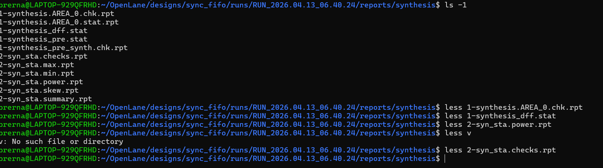

# Synchronous FIFO RTL to GDSII ASIC Flow

This repository implements a parameterized synchronous FIFO and demonstrates a complete RTL-to-GDSII ASIC flow using open-source EDA tools.

## Tools Used
- Yosys (RTL synthesis)
- Synthesis by Yosys
- OpenSTA (Static Timing Analysis)
- OpenROAD (Floorplanning, Placement, CTS, Routing)
- KLayout (GDSII visualization)

## Design Overview
- Parameterized synchronous FIFO
- Full / Empty and Almost-threshold flags
- Single clock domain

## 1) Load RTL file
commands in Ubuntu line by line
```bash
cd ~/Openlane
cd designs
mkdir sync_fifo  <your_foldername>
cd sync_folder
mkdir src config.json
vi config.json        
nano src/fifoRTL.v 

```

## 2) Synthesis by Yosys
Paste these commands in Ubuntu line by line:
```bash
cd ~/OpenLane
make mount
./flow.tcl -interactive
package require openlane
prep -design sync_fifo
run_synthesis
exit    //from openlane container to run 

navigate to sync_fifo folder
cd runs
ls
cd <obtianed_RUNCODE>
cd reports
cd synthesis
ls -1  //to check whether reports generated by yosys or not


```

## RTL-to-GDSII Flow
RTL → Synthesis → STA → Floorplanning → Placement → CTS → Routing → GDSII
